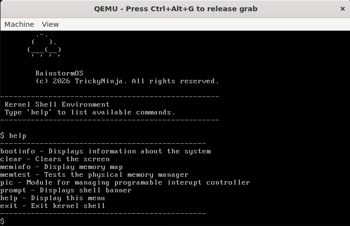

# RainstormOS

RainstormOS is a 32-bit x86 operating system written in C.
I started this project because I wanted to really understand how an OS works under the hood.
It's not meant to be "the next big thing". It's just a learning project.

## Why am I making this?

> because it's fun

That's genuinely the main reason.

I like low-level programming and understanding how things actually work, and operating systems were always a black box to me.

## Current Status

Right now RainstormOS is still early, it boots and I can interact with it through a basic shell.

What’s implemented so far:

- VGA text mode driver  
- Serial UART driver  
- Interrupts and PIC-based IRQ handling  
- Keyboard driver (interrupt-driven)  
- Basic kernel shell  
- Bitmap-based physical memory manager  

So for now its just:
- Boot -> Initialize hardware -> Accept input -> Run simple commands

## What I’m Working On Next
_I may change this list as im learning more about osdev_

- Enable paging  
- Build a virtual memory manager  
- Implement a kernel heap  
- Add context switching and multitasking  

## Future Plans

Long term, I want to push it further:

- ATA PIO disk reading
- Maybe APIC and AHCI stuff  
- FAT32 filesystem support  
- Multiboot2 support
- Proper graphics 
- User mode  

Basically I want this to be a fully working OS, possibly binary compaitable with linux.

## Contributing

This is mainly a personal learning project, but if you have suggestions, or notice something broken, just open an issue.

## Final Notes

RainstormOS is a project for me to learn more than anything else. I'm building it to understand things properly
And I fully expect to refactor large parts of this as I learn more.

